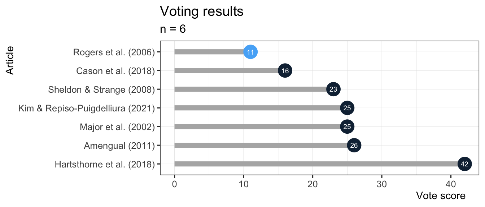

# Setup

    library("tidyverse")

# Load data

    vote_temp <- tribble(
      ~'voter', ~'rank', ~'article', 
      "ivan",1,"Effects of bilingualism, noise, and reverberation on speech perception by listeners with normal hearing",
      "ivan",2,"The acquisition of /r/ and /l/ by Japanese learners of English: Evidence that speech production can precede speech perception",
      "ivan",3,"Rhythmic Abilities Correlate with L2 Prosody Imitation Abilities in Typologically Different Languages",
      "ivan",4,"Interlingual influence in bilingual speech: Cognate status effect in a continuum of bilingualism",
      "ivan",5,"The Effects of Nonnative Accents on Listening Comprehension: Implications for ESL Assessment",
      "ivan",6,"Keeping a Critical Eye on Majority Language Influence: The Case of Uptalk in Heritage Spanish",
      "ivan",7,"A critical period for second language acquisition: Evidence from 2/3 million English speakers",
      "gabi",1,"The Effects of Nonnative Accents on Listening Comprehension: Implications for ESL Assessment",
      "gabi",2,"The acquisition of /r/ and /l/ by Japanese learners of English: Evidence that speech production can precede speech perception",
      "gabi",3,"Effects of bilingualism, noise, and reverberation on speech perception by listeners with normal hearing",
      "gabi",4,"Keeping a Critical Eye on Majority Language Influence: The Case of Uptalk in Heritage Spanish",
      "gabi",5,"Interlingual influence in bilingual speech: Cognate status effect in a continuum of bilingualism",
      "gabi",6,"Rhythmic Abilities Correlate with L2 Prosody Imitation Abilities in Typologically Different Languages",
      "gabi",7,"A critical period for second language acquisition: Evidence from 2/3 million English speakers",
      "kyle",1,"Effects of bilingualism, noise, and reverberation on speech perception by listeners with normal hearing",
      "kyle",2,"Rhythmic Abilities Correlate with L2 Prosody Imitation Abilities in Typologically Different Languages",
      "kyle",3,"The Effects of Nonnative Accents on Listening Comprehension: Implications for ESL Assessment",
      "kyle",4,"Interlingual influence in bilingual speech: Cognate status effect in a continuum of bilingualism",
      "kyle",5,"The acquisition of /r/ and /l/ by Japanese learners of English: Evidence that speech production can precede speech perception",
      "kyle",6,"Keeping a Critical Eye on Majority Language Influence: The Case of Uptalk in Heritage Spanish",
      "kyle",7,"A critical period for second language acquisition: Evidence from 2/3 million English speakers",
      "juanjo",1,"Rhythmic Abilities Correlate with L2 Prosody Imitation Abilities in Typologically Different Languages",
      "juanjo",2,"Effects of bilingualism, noise, and reverberation on speech perception by listeners with normal hearing",
      "juanjo",3,"Interlingual influence in bilingual speech: Cognate status effect in a continuum of bilingualism",
      "juanjo",4,"The acquisition of /r/ and /l/ by Japanese learners of English: Evidence that speech production can precede speech perception",
      "juanjo",5,"Keeping a Critical Eye on Majority Language Influence: The Case of Uptalk in Heritage Spanish",
      "juanjo",6,"The Effects of Nonnative Accents on Listening Comprehension: Implications for ESL Assessment",
      "juanjo",7,"A critical period for second language acquisition: Evidence from 2/3 million English speakers",
      "laura",1,"Effects of bilingualism, noise, and reverberation on speech perception by listeners with normal hearing",
      "laura",2,"Rhythmic Abilities Correlate with L2 Prosody Imitation Abilities in Typologically Different Languages",
      "laura",3,"Keeping a Critical Eye on Majority Language Influence: The Case of Uptalk in Heritage Spanish",
      "laura",4,"The acquisition of /r/ and /l/ by Japanese learners of English: Evidence that speech production can precede speech perception",
      "laura",5,"The Effects of Nonnative Accents on Listening Comprehension: Implications for ESL Assessment",
      "laura",6,"Interlingual influence in bilingual speech: Cognate status effect in a continuum of bilingualism",
      "laura",7,"A critical period for second language acquisition: Evidence from 2/3 million English speakers",
      "gabo",1,"Keeping a Critical Eye on Majority Language Influence: The Case of Uptalk in Heritage Spanish",
      "gabo",2,"Rhythmic Abilities Correlate with L2 Prosody Imitation Abilities in Typologically Different Languages",
      "gabo",3,"Effects of bilingualism, noise, and reverberation on speech perception by listeners with normal hearing",
      "gabo",4,"Interlingual influence in bilingual speech: Cognate status effect in a continuum of bilingualism",
      "gabo",5,"The Effects of Nonnative Accents on Listening Comprehension: Implications for ESL Assessment",
      "gabo",6,"The acquisition of /r/ and /l/ by Japanese learners of English: Evidence that speech production can precede speech perception",
      "gabo",7,"A critical period for second language acquisition: Evidence from 2/3 million English speakers"
    )

    # Look-up table for abreviated titles
    short_titles <- tribble(
      ~"short_title", ~"article", 
      "Rogers et al. (2006)", "Effects of bilingualism, noise, and reverberation on speech perception by listeners with normal hearing", 
      "Sheldon & Strange (2008)", "The acquisition of /r/ and /l/ by Japanese learners of English: Evidence that speech production can precede speech perception", 
      "Amengual (2011)", "Interlingual influence in bilingual speech: Cognate status effect in a continuum of bilingualism", 
      "Hartsthorne et al. (2018)", "A critical period for second language acquisition: Evidence from 2/3 million English speakers", 
      "Major et al. (2002)", "The Effects of Nonnative Accents on Listening Comprehension: Implications for ESL Assessment", 
      "Kim & Repiso-Puigdelliura (2021)", "Keeping a Critical Eye on Majority Language Influence: The Case of Uptalk in Heritage Spanish", 
      "Cason et al. (2018)", "Rhythmic Abilities Correlate with L2 Prosody Imitation Abilities in Typologically Different Languages"
      )

    # Add short titles to dataframe
    vote <- vote_temp %>% 
      left_join(., short_titles, by = "article")

# Sanity checks

    # Check unique articles
    vote %>% pull(article) %>% unique

    ## [1] "Effects of bilingualism, noise, and reverberation on speech perception by listeners with normal hearing"                      
    ## [2] "The acquisition of /r/ and /l/ by Japanese learners of English: Evidence that speech production can precede speech perception"
    ## [3] "Rhythmic Abilities Correlate with L2 Prosody Imitation Abilities in Typologically Different Languages"                        
    ## [4] "Interlingual influence in bilingual speech: Cognate status effect in a continuum of bilingualism"                             
    ## [5] "The Effects of Nonnative Accents on Listening Comprehension: Implications for ESL Assessment"                                 
    ## [6] "Keeping a Critical Eye on Majority Language Influence: The Case of Uptalk in Heritage Spanish"                                
    ## [7] "A critical period for second language acquisition: Evidence from 2/3 million English speakers"

    # Check n unique articles matches n candidates from github issue
    n_candidates <- 7
    n_candidates == vote %>% pull(article) %>% unique %>% length

    ## [1] TRUE

# Rank voting

    # Score articles (1 = 1 point, 2 = 2 points, etc.), lower score is better
    vote_results <- vote %>% 
      group_by(article, short_title) %>% 
      summarize(total_votes = sum(rank), .groups = "drop") %>% 
      arrange(total_votes)

    # Create table
    vote_results %>% 
      select(short_title, total_votes) %>% 
      knitr::kable(output = "markdown")

<table>
<thead>
<tr class="header">
<th style="text-align: left;">short_title</th>
<th style="text-align: right;">total_votes</th>
</tr>
</thead>
<tbody>
<tr class="odd">
<td style="text-align: left;">Rogers et al. (2006)</td>
<td style="text-align: right;">11</td>
</tr>
<tr class="even">
<td style="text-align: left;">Cason et al. (2018)</td>
<td style="text-align: right;">16</td>
</tr>
<tr class="odd">
<td style="text-align: left;">Sheldon &amp; Strange (2008)</td>
<td style="text-align: right;">23</td>
</tr>
<tr class="even">
<td style="text-align: left;">Kim &amp; Repiso-Puigdelliura (2021)</td>
<td style="text-align: right;">25</td>
</tr>
<tr class="odd">
<td style="text-align: left;">Major et al. (2002)</td>
<td style="text-align: right;">25</td>
</tr>
<tr class="even">
<td style="text-align: left;">Amengual (2011)</td>
<td style="text-align: right;">26</td>
</tr>
<tr class="odd">
<td style="text-align: left;">Hartsthorne et al. (2018)</td>
<td style="text-align: right;">42</td>
</tr>
</tbody>
</table>

    # Plot results
    vote_results %>% 
      mutate(short_title = fct_reorder(short_title, total_votes, min), 
        min = min(total_votes), 
        is_winner = if_else(total_votes == min, 1, 0)) %>% 
      ggplot(., aes(x = total_votes, y = short_title, label = total_votes)) + 
        geom_segment(aes(x = 0, xend = total_votes, yend = short_title), 
          color = "grey70", size = 2.5) + 
        geom_point(size = 7, stroke = 0, aes(color = is_winner), show.legend = F) + 
        geom_text(size = 2.5, color = "white") + 
        scale_y_discrete(limits = rev) + 
        labs(y = "Article", x = "Vote score") + 
        ds4ling::ds4ling_bw_theme(base_size = 12)

